# Meeting Tycoon — How the Game Actually Works

> A reference for players who want to know what's behind the calendar, and
> for contributors who want to extend it without breaking the math.

This document is the gameplay manual. The [README](./README.md) is for
running the project. Start here if you want to know what every screen and
every number means.

<p align="center">
  <a href="https://babanomania.github.io/meeting-tycoon/"><strong>▶ Play in browser</strong></a>
  &nbsp;·&nbsp;
  <a href="./README.md">Back to README</a>
</p>

---

## Table of contents

1. [The premise](#the-premise)
2. [The tour](#the-tour)
3. [A typical day](#a-typical-day)
4. [The six KPIs](#the-six-kpis)
5. [The recovery loop](#the-recovery-loop)
6. [The six stakeholders](#the-six-stakeholders)
7. [The five stages](#the-five-stages)
8. [Chaos events](#chaos-events)
9. [Eight endings](#eight-endings)
10. [Chat](#chat)
11. [Save data](#save-data)
12. [Reading the code](#reading-the-code)
13. [Regenerating these screenshots](#regenerating-these-screenshots)

---

## The premise

You're the new manager at **Acme Corp** — a 23-person company that holds
127 meetings a week and spends 2% of its time on actual work. You report
to **David Chen** ("Your Boss"). Above him: a CEO who saw a competitor
demo last night, a CFO with a spreadsheet of spreadsheets, a CTO
threatening "no-meeting Mondays," a CHRO with a wellness survey, and a VP
of Strategy who brought a framework.

You have **25 in-game days** (5 stages × 5 days). Each day plays in about
90 seconds. At the end of Day 25 you either get **promoted to VP**, get a
**lateral move** (the corporate consolation prize), or get put on a
**Performance Improvement Plan**.

In between: 8 thematic ways to fail.

---

## The tour

Nine screens, top to bottom: where you start, where you live, where you
end up. Read this once and the rest of the doc becomes a reference.

<table>
<tr>
<td width="33%" align="center">
  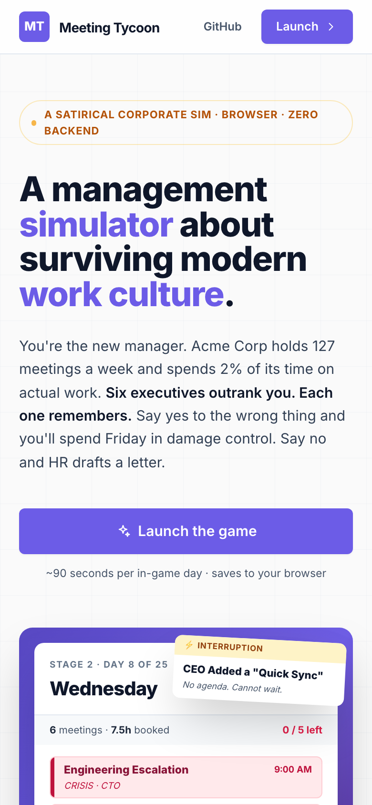<br>
  <sub><b>Landing.</b> White Fluent surface, big "holds a grudge" headline, "Launch the game" CTA.</sub>
</td>
<td width="33%" align="center">
  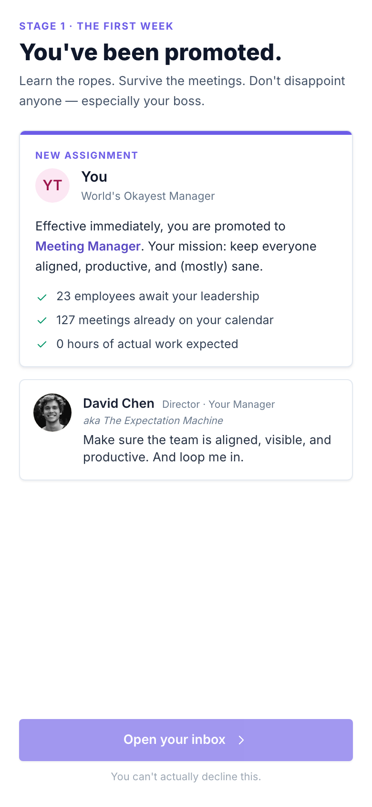<br>
  <sub><b>Onboarding.</b> David Chen's assignment letter. You can't actually decline.</sub>
</td>
<td width="33%" align="center">
  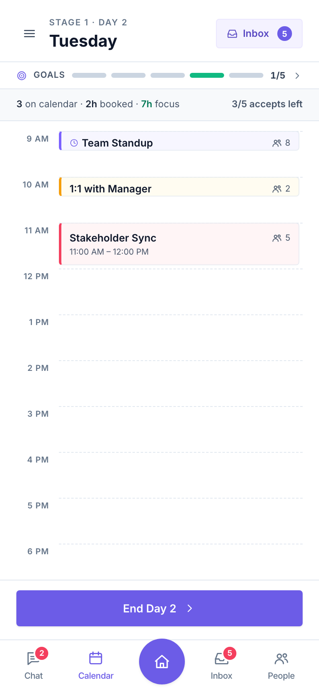<br>
  <sub><b>Calendar.</b> Your agenda for today. Hours 9 AM – 6 PM, color-coded by priority.</sub>
</td>
</tr>
<tr>
<td width="33%" align="center">
  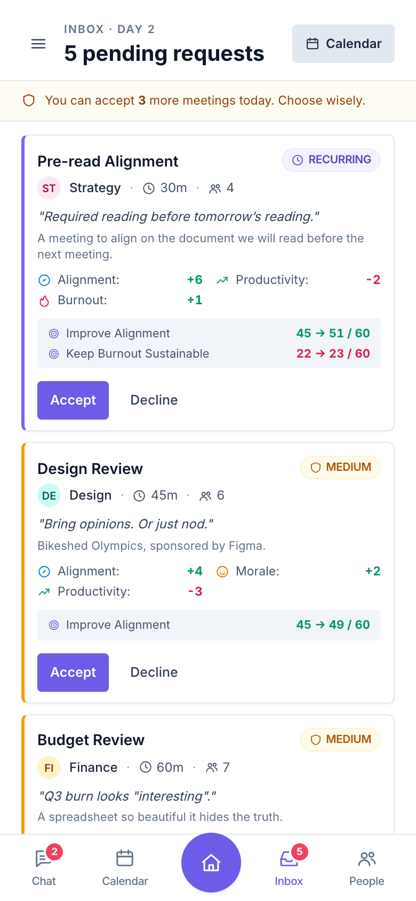<br>
  <sub><b>Inbox.</b> Pending meeting requests with KPI projections per request.</sub>
</td>
<td width="33%" align="center">
  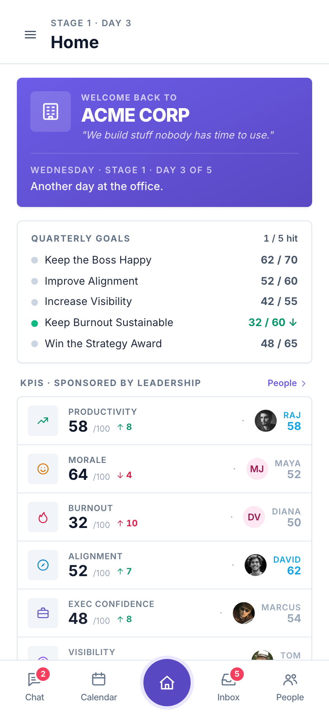<br>
  <sub><b>Home.</b> Company hero, quarterly goals, KPI×Sponsor matrix.</sub>
</td>
<td width="33%" align="center">
  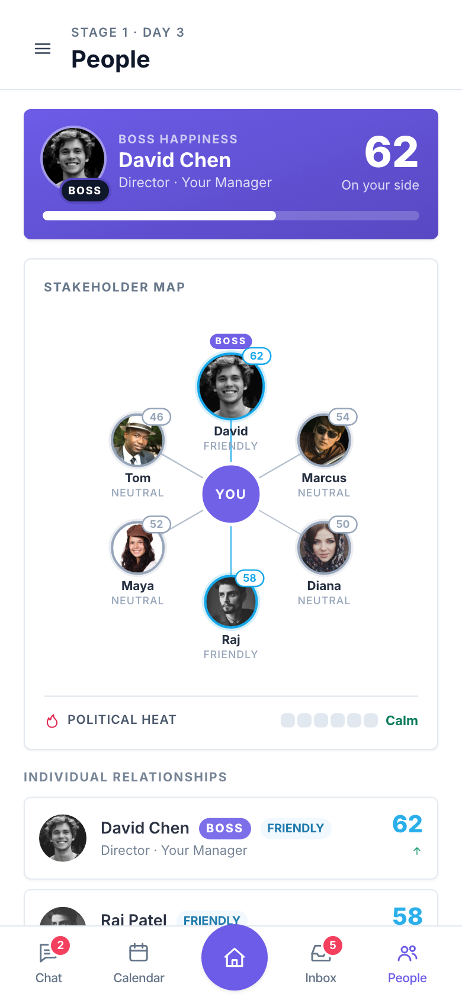<br>
  <sub><b>People.</b> Boss happiness card + the hub-and-spoke stakeholder map.</sub>
</td>
</tr>
<tr>
<td width="33%" align="center">
  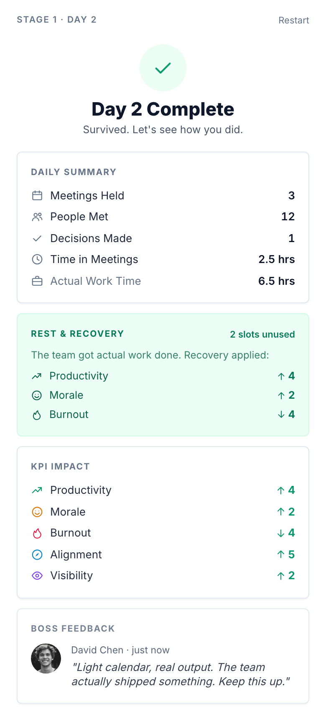<br>
  <sub><b>Day Summary.</b> Meetings held, Rest & Recovery card, KPI Impact, David's one-line review.</sub>
</td>
<td width="33%" align="center">
  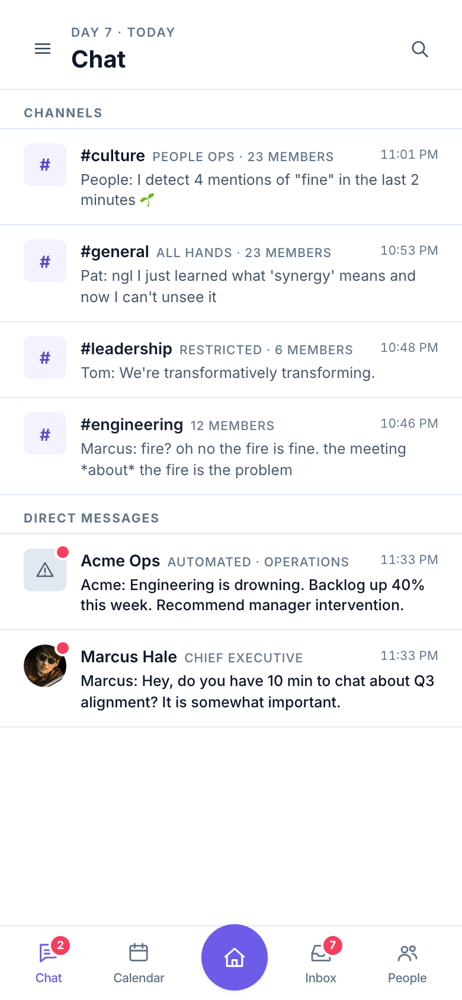<br>
  <sub><b>Chat.</b> Four group channels plus DMs from stakeholders. Teams-style.</sub>
</td>
<td width="33%" align="center">
  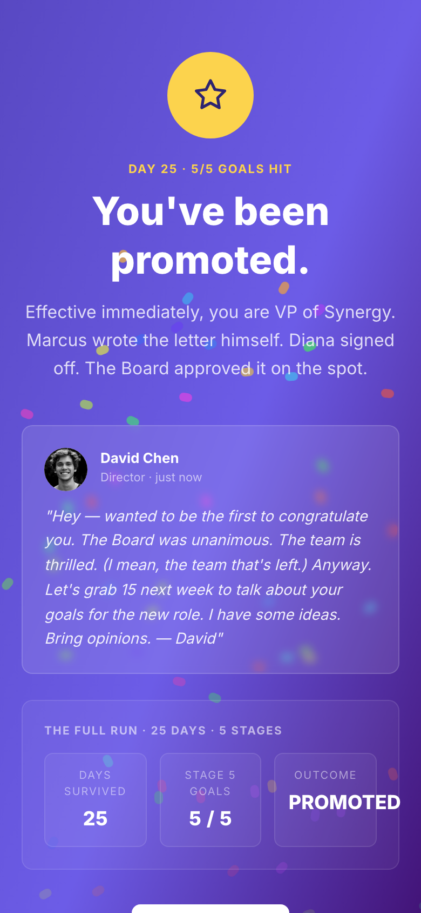<br>
  <sub><b>Promotion.</b> The Day 25 win condition. Confetti. David's congrats letter.</sub>
</td>
</tr>
</table>

**Calendar, Inbox, Home, People** are where you live. **Landing,
Onboarding, Day Summary, Chat, Promotion** are the bookends.

---

## A typical day

A single in-game day flows like this — most days take ~90 seconds real
time:

1. **Calendar** opens with whatever recurring meetings carried over from
   yesterday plus any forced chaos that fired at day-start.
2. **Inbox** has 6–8 pending requests. You accept up to 5 (4 from Stage 2
   onward). Each card shows KPI delta and goal movement upfront.
3. **Chaos** fires somewhere between accept #2 and accept #4 with ~60%
   probability. Modal slides up — you Attend, Delegate, Reschedule, or
   (Stage 3+) Pass to Boss.
4. **Chat** updates throughout — group channels react to your actions,
   DMs from stakeholders surface with reply options that shift
   relationships.
5. **Home** at any point shows the current vibe headline, 5 quarterly
   goals, and the KPI ↔ sponsor matrix.
6. **People** lets you inspect each stakeholder. Stage 4+ overlays
   alliance and feud arcs on the map.
7. **End Day** → Day Summary calculates meetings × chaos × rest recovery
   × (Stage 4+) alliances × (Stage 5+) AI Notes Bot, then routes to:
   - Next day (default)
   - Stage Unlock splash (crossing a stage boundary)
   - Game Over (one of seven failure modes)
   - Promotion (Day 25)

---

## The six KPIs

All KPIs are 0–100. **Burnout is inverted** — lower is better.

| KPI | Sponsor | Moves up when… | Moves down when… |
|---|---|---|---|
| **Productivity** | Raj (CTO) | Light calendar, shield meetings, focus blocks | Crisis meetings, every accepted meeting |
| **Morale** | Maya (CHRO) | Culture syncs, retros, 1:1s, restraint | Town halls, reorgs, PR disasters |
| **Burnout** | Diana (CFO) | _Lower is better._ Rest, shield meetings | Crisis events, board pre-reads, full days |
| **Alignment** | David (Boss) | Standups, OKRs, alignment meetings | Skipped recurrings, active feuds |
| **Exec Confidence** | Marcus (CEO) | Board pre-reads, QBRs, fast replies | Rescheduled exec chaos, PR disasters |
| **Visibility** | Tom (VP) | Town halls, dashboard reports, board sync | Cooking the books (Stage 5+) |

The Home screen (see Tour) pairs each KPI with its sponsor's relationship
score side by side — making the cause/effect visible. A sponsor going
hostile usually means you're about to bleed their KPI.

---

## The recovery loop

The single most important balancing mechanic. Without it the game would
only ever take from you.

**At end of day, per unused accept slot:**

- **Productivity +2**
- **Burnout −2**
- **Morale +1**

An empty calendar earns +10 / −10 / +5. A maxed-out day earns nothing.

The Day Summary screen (see Tour) shows this explicitly as a dedicated
"Rest & Recovery" card. **Restraint is a strategy.** The card is the
visible reward.

---

## The six stakeholders

| Id | Name | Role | Why they matter |
|---|---|---|---|
| `boss` | **David Chen** | Director · your manager | Default relationship. Goal in every stage. Promotion gates through him. |
| `ceo` | **Marcus Hale** | Chief Executive | Promotion letter writer. Posts on LinkedIn. Triggers PR Disaster with the Boss. |
| `cfo` | **Diana Vargas** | Chief Financial Officer | Audits the books. Blocks budgets. Gates Stage 5 Promotion. |
| `cto` | **Raj Patel** | Chief Technology Officer | Files "no-meeting Mondays" manifestos. Owns Productivity. |
| `chro` | **Maya** | Chief People Officer | Owns Morale. Watches reorg fallout in Stage 2+. |
| `vp_strategy` | **Tom Whitfield** | VP, Strategy | Owns Visibility. Brings frameworks. Feuds with CTO. |

Each starts at **50/100** (neutral). The People map (see Tour) colors
edges and rings by sentiment — friendly is teal, hostile is rose, neutral
is grey.

**Stage 3+ applies a politics multiplier:** ×1.5 at Stage 3, ×1.75 at
Stage 4+. Every relationship delta scales. Mistakes get more expensive.

---

## The five stages

Each stage runs **5 in-game days**. Pressure scales by adding new
mechanics, not bigger numbers.

| Stage | Days | Theme | Key cap change |
|---|---|---|---|
| 1 | 1–5 | The First Week | 6 requests/day, 5 accepts |
| 2 | 6–10 | Welcome to Reality | **8 requests/day, 4 accepts** |
| 3 | 11–15 | Bureaucracy | Same caps, approval chains added |
| 4 | 16–20 | Corporate Madness | Same caps, alliances/feuds active |
| 5 | 21–25 | Executive Absurdity | Same caps, every accept spawns a committee |

The most-felt change is the **Stage 2 cap drop from 5 → 4**. Once it
lands, every "yes" forces a "no" somewhere else.

Crossing a stage boundary triggers a confetti splash that previews what's
coming:

<table>
<tr>
<td width="25%" align="center">
  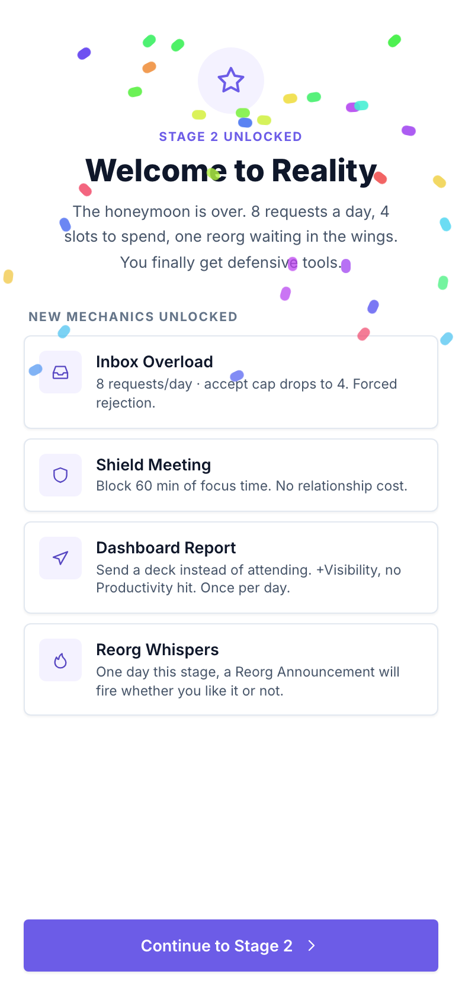<br>
  <sub><b>Stage 2</b><br>Welcome to Reality</sub>
</td>
<td width="25%" align="center">
  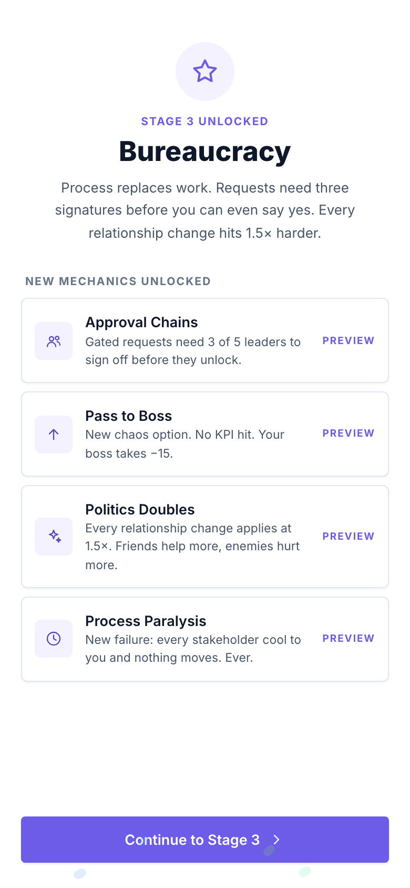<br>
  <sub><b>Stage 3</b><br>Bureaucracy</sub>
</td>
<td width="25%" align="center">
  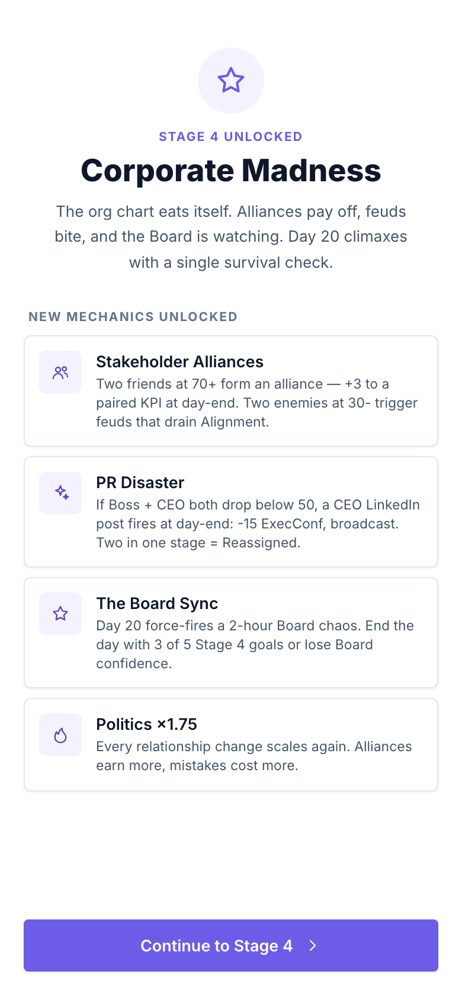<br>
  <sub><b>Stage 4</b><br>Corporate Madness</sub>
</td>
<td width="25%" align="center">
  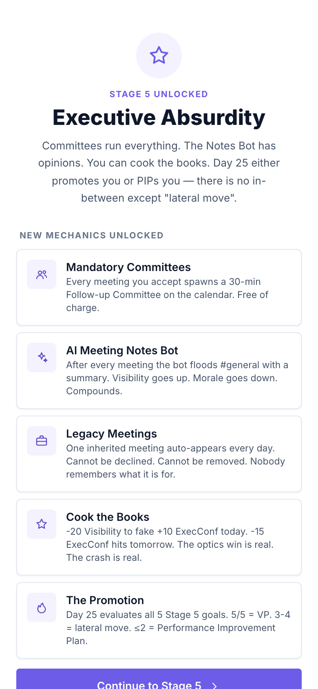<br>
  <sub><b>Stage 5</b><br>Executive Absurdity</sub>
</td>
</tr>
</table>

### Stage 1 — The First Week

> Days 1–5. Learn the ropes. Or pretend to.

The baseline. 6 requests/day, 5 accept slots, 4 chaos events possible.
5 quarterly goals (Boss ≥70, Alignment ≥60, Visibility ≥55, Burnout ≤60,
ExecConf ≥65). You can win or lose Stage 1 entirely on your
accept/decline pattern.

**Failures possible:** Team Walkout (Morale ≤10), Forced Sabbatical
(Burnout ≥92), Reassigned (ExecConf ≤15).

### Stage 2 — Welcome to Reality

> Days 6–10. The honeymoon ends Monday.

- **Inbox Overload** — pool grows to 8/day, cap drops to 4.
- **Shield Meeting** — 60 min focus block. +6 Prod / +2 Morale / −3 Burn,
  zero relationship hit. Costs one accept slot.
- **Dashboard Report** — once-per-day. +5 Vis / +3 ExecConf, no Prod
  cost.
- **Recurring Cost Inflation** — declining a recurring meeting now hits
  ×1.5 harder.
- **Reorg Whispers** — one random day from Day 7+ (forced on Day 10), the
  `reorg-announce` chaos fires at day-start regardless of accept count.
- **New chaos:** `reorg-announce`, `quarterly-surprise`, `two-town-halls`.

Both new defensive tools appear in the Calendar header. Note the new
"Wednesday · Week 2" title, "1/4 accepts left" capacity strip, and the
**Focus Time (Blocked)** emerald block mid-day — the player's own Shield
Meeting in action:

<p align="center">
  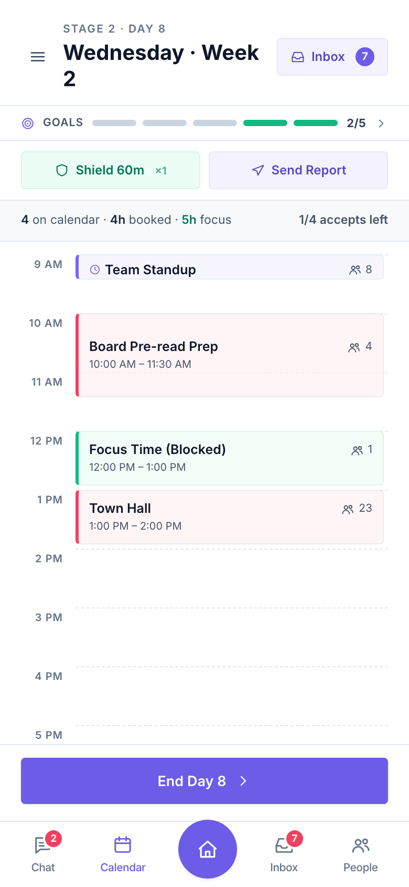
</p>

**New failure:** **"Restructured"** — 4+ stakeholders ≤50 → game over.

### Stage 3 — Bureaucracy

> Days 11–15. Process eats people.

- **Approval Chains** — ~2 of every 8 daily requests carry an `approvers`
  list and need 3 of 5 sign-offs. You **cannot accept** until enough
  listed stakeholders sign off.
- **Carryover Queue** — approval-gated requests carry to tomorrow's
  inbox if not actioned.
- **Pass to Boss** — new 4th chaos option. Zero KPI hit, −15 Boss
  relationship.
- **Politics ×1.5.**
- **New chaos:** `cfo-blocks-budget`, `cto-no-meeting-mondays`,
  `vp-quarterly-deepdive`.

<table>
<tr>
<td width="50%" align="center">
  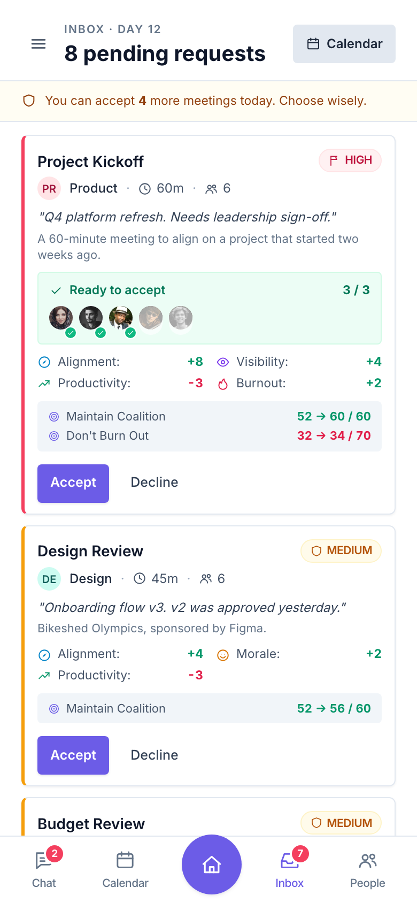<br>
  <sub><b>Approval chain unlocked.</b> The green "Ready to accept · 3/3" chip means CFO, CTO, and VP all signed off — Accept is no longer disabled. Approver avatars show on the card.</sub>
</td>
<td width="50%" align="center">
  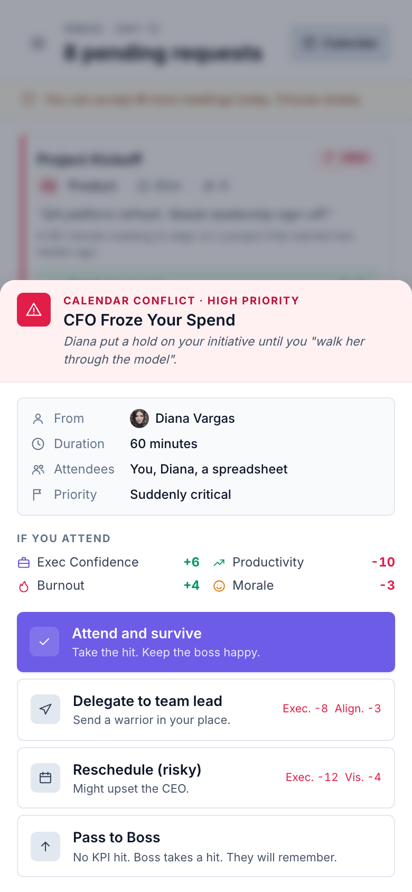<br>
  <sub><b>Pass to Boss.</b> The 4th chaos option (Stage 3+ only). No KPI hit, but David takes a relationship hit. "They will remember."</sub>
</td>
</tr>
</table>

**New failure:** **Process Paralysis** — every stakeholder ≤50
simultaneously → game over.

#### How approval ticking works

Per pending approval-gated request, per tick, for each not-yet-approved
stakeholder in its `approvers` list:

```
relationship ≥ 70  → 55% chance to sign off
relationship 50–69 → 35% chance
relationship 30–49 → 20% chance
relationship < 30  → 10% chance
```

Ticks fire on: every accept, every decline, day-start. Chains move
visibly through the day; rough mornings drag.

### Stage 4 — Corporate Madness

> Days 16–20. The org chart eats itself.

- **Stakeholder Alliances** — five hand-picked pairs (Boss⇄CEO, CFO⇄CEO,
  CEO⇄VP, CTO⇄CHRO, VP⇄CHRO). When both members sit ≥70, an alliance
  forms and adds **+3 to a themed KPI** at day-end.
- **Feuds** — both members ≤30 → **−3 Alignment** per feud at day-end.
- **PR Disaster auto-fire** — if Boss AND CEO both drop below 50 at
  day-end, CEO posts on LinkedIn: −15 ExecConf, +4 Vis, −3 Morale,
  chat broadcast. **2 strikes in one stage = "Reassigned to Special
  Projects"** game over.
- **Politics ×1.75.**
- **New chaos:** `backchannel-cfo`, `feud-cto-vp`, `ceo-linkedin-disaster`,
  `board-pre-read-rush`.

The People map gains green **ALLIANCE** arcs the moment a pair both
cross ≥70 — three are visible here (boss⇄CEO, CFO⇄CEO, CEO⇄VP):

<p align="center">
  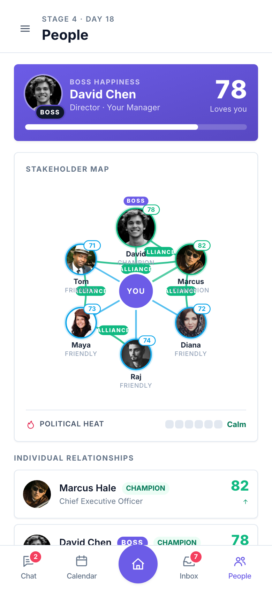
</p>

**The Day 20 Board Sync** — climax. A 2-hour `board-sync` chaos
force-fires at day-start. At end of Day 20:

- **3+ of 5 Stage 4 goals hit** → Stage 5 unlock splash
- **<3 hit** → **Board Confidence Lost** game over

### Stage 5 — Executive Absurdity

> Days 21–25. Maintain the illusion.

- **Mandatory Committees** — every accepted meeting silently spawns a
  30-min Follow-up Committee on the same day's calendar. Doesn't count
  against the cap; eats focus time.
- **AI Meeting Notes Bot** — at day-end, for every meeting type held,
  the bot fires a `#general` summary. +1 Vis / −1 Morale per fire,
  compounding.
- **Legacy Meetings** — one undeclinable inherited meeting auto-appears
  at every Stage 5 day-start. **Cannot be removed.**
- **Cook the Books** — once-per-day. **−20 Visibility for +10 ExecConf**
  today. Queues **−15 ExecConf for tomorrow** as `illusionDebt`.
- **New chaos:** `committee-spawn`, `ai-takeover`, `cfo-illusion-audit`.

The Calendar gains a third defensive button — **Cook the Books** (amber).
The agenda shows all three Stage 5 meeting flavors at once: recurring
Standup, undeclinable Legacy Sync, real QBR, and an auto-spawned
Follow-up Committee:

<p align="center">
  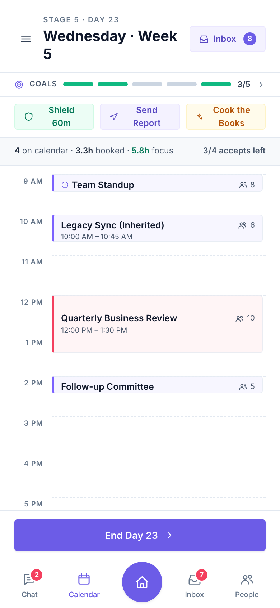
</p>

**The Day 25 Promotion** — endgame evaluation:

- **5 of 5 goals hit** → **Promoted to VP of Synergy.**
- **3–4 hit** → **"Lateral move"** (same Promotion screen, muted copy).
- **≤2 hit** → **Performance Improvement Plan** (8th failure mode).

---

## Chaos events

Random corporate interruptions that fire during day play, between
accept #2 and accept #4 with ~60% probability. The Chaos modal slides
up from the bottom and shows the consequences of each response upfront
— you're never surprised by the math, only by the situation.

Up to **four response options** per chaos:

- **Attend** — take the productivity hit, keep the boss happy.
- **Delegate** — send a warrior in your place. Less KPI cost, mild
  relationship hit.
- **Reschedule** — punt the meeting. Big relationship hit.
- **Pass to Boss** _(Stage 3+ only)_ — −15 Boss, zero KPI. The Stage 3
  modal screenshot above shows all four.

Stages add pools: Stage 1 has 4 events. Stages 2–5 add 3–4 each.
Some are force-fired (Stage 2's Reorg, Stage 4's Board Sync).

---

## Eight endings

Seven failure modes and one win condition. Each ending is named
specifically because the ending IS the punchline.

### Failures

| Ending | Triggered by | Earliest stage |
|---|---|---|
| **Team Walkout** | Morale ≤10 | Stage 1 |
| **Reassigned** | ExecConf ≤15 | Stage 1 |
| **Forced Sabbatical** | Burnout ≥92 | Stage 1 |
| **"Restructured"** | 4+ stakeholders ≤50 | Stage 2+ |
| **Process Paralysis** | All 6 stakeholders ≤50 simultaneously | Stage 3+ |
| **Board Confidence Lost** | <3 of 5 Stage 4 goals at end of Day 20 | Stage 4 |
| **Reassigned to Special Projects** | 2+ PR Disasters in one stage | Stage 4+ |
| **Performance Improvement Plan** | ≤2 of 5 Stage 5 goals at end of Day 25 | Stage 5 |

### Win

| Ending | Triggered by |
|---|---|
| **VP of Synergy (Promoted)** | 5 of 5 Stage 5 goals at end of Day 25 |

A "Lateral Move" (3–4 of 5 Stage 5 goals) routes to the Promotion screen
with consolation copy. Not a failure, not a win.

Failures use a single screen pattern — thematic icon, named ending,
in-character body, final 6-KPI snapshot, "Start over" button. The
Promotion screen is its own surface (full-bleed brand purple, confetti,
David's congrats letter, 25-day stats):

<table>
<tr>
<td width="50%" align="center">
  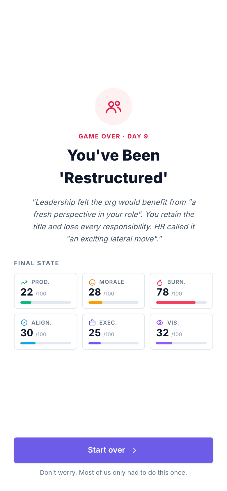<br>
  <sub><b>A failure ending.</b> The "Restructured" screen with HR's lateral-move letter and the final 6-KPI snapshot.</sub>
</td>
<td width="50%" align="center">
  <br>
  <sub><b>The win.</b> Confetti. "You've been promoted." David writes the congrats letter himself.</sub>
</td>
</tr>
</table>

---

## Chat

The chat system seeds with corporate gossip on Day 1 and reacts to your
actions throughout the run. See the chat list in the [Tour](#the-tour)
above.

Three conversation kinds:

- **Group channels** (`#general`, `#engineering`, `#leadership`,
  `#culture`) — read-only. The team gossips, leadership broadcasts, HR
  reminds you about cameras-on policy. React in real time via the
  `EVENT_REACTIONS` table.
- **Meeting chats** — auto-created per meeting type the first time you
  accept one. Accumulates pre-meeting chatter plus post-meeting
  follow-ups when the meeting "happens" at end of day.
- **DMs** — 1:1 threads with named characters. Templates fire based on
  triggers (morning, on-accept, on-decline, on-chaos, random). Each DM
  offers three reply options shifting the stakeholder's relationship by
  +3 / 0 / −4 (scaled by the politics multiplier).

Every chat event keys off a `ChatEvent` discriminated union. New
mechanics typically add a new event type (`approval-cleared`,
`pr-disaster-fired`, `ai-notes-fired`) so chat can react.

---

## Save data

State persists to `localStorage` under the key `meeting-tycoon-save` via
Zustand's `persist` middleware. **Bumping `version` in
`src/game/store.ts` wipes all saves** on next load — done whenever new
state fields or new game-over reasons are added.

There's no migration logic. The game is short (25 days, ~30 min) so
losing a save on an upgrade is acceptable.

Current version: **14** (Stage 5 + Promotion screen).

---

## Reading the code

| File | What's in it |
|---|---|
| `src/game/types.ts` | All domain types — `Kpis`, `MeetingType`, `ChatEvent`, `GameOverReason`, `FlowScreen` |
| `src/game/data.ts` | `MEETING_TYPES`, `REQUEST_POOL` (D1–25), `CHAOS_EVENTS`, `STAGE_GOALS`, `capFor`, `politicsMultiplier`, `stageGoalsFor` |
| `src/game/store.ts` | The Zustand store. Every game rule. Single source of truth. ~1300 lines, mostly comments. |
| `src/game/politics.ts` | Stakeholder roster, sentiment math, `senderToStakeholder`, `detectAlliances` |
| `src/game/chat.ts` | Seed conversations, `DM_TEMPLATES`, `EVENT_REACTIONS`, `MEETING_HELD_TEMPLATES` |
| `src/game/characters.ts` | Display name + avatar resolution |

If you want to know *why* a number moved, search `src/game/store.ts` for
the action that fired (`acceptRequest`, `declineRequest`, `resolveChaos`,
`endDay`). Every relationship change and KPI delta has a comment
explaining it.

---

## Regenerating these screenshots

```bash
npm run dev          # in one terminal
npm run screenshots  # in another — Playwright + Chromium
```

The script (`scripts/take-screenshots.mjs`) opens the live preview,
pokes the Zustand store via `window.__useGame.setState(...)` to land on
each scene, and saves PNGs to `docs/assets/screenshots/`. The script
wipes the output directory before each run, so renaming a scene won't
leave orphan files behind. Store exposure on window is dev-only — see
`src/main.tsx`.
