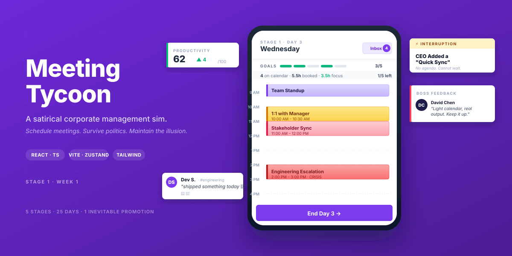

# Meeting Tycoon

> A satirical corporate management sim. Schedule meetings. Survive politics. Maintain the illusion.

<p align="center">
  
</p>

<p align="center">
  <a href="https://babanomania.github.io/meeting-tycoon/"><strong>▶ Play now</strong></a>
  &nbsp;·&nbsp;
  <a href="./GAMEPLAY.md">How it works</a>
  &nbsp;·&nbsp;
  <a href="https://github.com/babanomania/meeting-tycoon/issues">Report a bug</a>
</p>

<p align="center">
  
  
  
  
</p>

---

You're the new manager at **Acme Corp**, a 23-person company that holds 127
meetings a week and spends 2% of its time on actual work. Six executives
outrank you. Each one remembers everything. You have 25 in-game days
(about 30 minutes real time) to get promoted to VP — or get reassigned to
Special Projects, restructured, paralysed by process, or one of five other
thematic ways to lose.

The game is the joke. The joke is corporate life.

---

## Quick start

```bash
npm install
npm run dev        # → http://localhost:5173
npm run build      # production bundle in dist/
npm run typecheck  # tsc -b --noEmit
```

No backend. No accounts. State persists to `localStorage` under
`meeting-tycoon-save`.

---

## How does the game actually work?

→ **[GAMEPLAY.md](./GAMEPLAY.md)** — every system, every stage, every
ending. Six KPIs. Six stakeholders. Five stages. Eight endings. How
approval chains tick, how alliances form, how the Promotion is
calculated. Spoils everything if that's what you want.

If you'd rather discover it by playing, **[the live game](https://babanomania.github.io/meeting-tycoon/)**
ships fresh saves on every push to `main`.

---

## Stack

- **React 18** + **TypeScript** + **Vite 6** — SPA, single bundle
- **Tailwind CSS** — Microsoft Fluent-inspired (4–8 px corners, subtle shadows)
- **Zustand** — single store, `persist` middleware to `localStorage`
- **Framer Motion** — screen transitions, the confetti, the toast

Mobile-first, designed to look like Microsoft Teams / Outlook on a
phone. On laptop/desktop (`lg:` 1024px+) the UI renders inside a
`<PhoneFrame />` mockup so the simulation always feels handheld.

---

## Project layout

```
src/
├── components/          # PhoneFrame, ChaosModal, KpiToast, StakeholderMap, etc.
├── game/
│   ├── types.ts         # Domain types — Kpis, MeetingType, ChatEvent, GameOverReason
│   ├── data.ts          # MEETING_TYPES, REQUEST_POOL (D1-25), CHAOS_EVENTS, STAGE_GOALS
│   ├── store.ts         # The Zustand store. Single source of truth. Every game rule.
│   ├── politics.ts      # Stakeholder roster, sentiment math, alliance detection
│   ├── chat.ts          # Seed conversations, DM_TEMPLATES, EVENT_REACTIONS
│   └── characters.ts    # Display name + avatar resolution
├── screens/
│   ├── Landing.tsx      # Marketing page (white Fluent surface, full-width)
│   ├── Onboarding.tsx   # First-run flow
│   ├── Calendar.tsx     # Day agenda grid (the main play surface)
│   ├── Inbox.tsx        # Meeting requests + impact projection + approval chips
│   ├── Chat.tsx         # Teams-style channel + DM list
│   ├── ChatThread.tsx   # Open thread view
│   ├── Home.tsx         # Company hero + Quarterly Goals + KPI×Sponsor matrix
│   ├── People.tsx       # Stakeholder map (hub-and-spoke, alliance overlays)
│   ├── DaySummary.tsx   # End-of-day recap
│   ├── StageUnlock.tsx  # Splash between stages
│   ├── GameOver.tsx     # 7 failure modes
│   └── Promotion.tsx    # Day 25 win/lateral screen
└── App.tsx              # Screen router (Landing + Promotion render outside PhoneFrame)
```

The store is intentionally thick. Every gameplay rule lives in
`store.ts` so screens stay thin projections of state. New mechanics
generally mean: a new action on the store + a new UI surface that calls
it + an entry in `EVENT_REACTIONS` so chat reflects the change.

---

## Extending the game

### Adding a new meeting type

1. Add the id to `MeetingTypeId` in `src/game/types.ts`.
2. Add a `MeetingType` entry to `MEETING_TYPES` in `src/game/data.ts`
   with `durationMin`, `attendees`, `priority`, `impact`, and a
   `flavor` line of corporate humor.
3. _(Optional)_ Add it to `MEETING_CHAT_META` and
   `MEETING_HELD_TEMPLATES` in `src/game/chat.ts` so the meeting gets a
   chat thread and post-meeting chatter.
4. Reference it from a day in `REQUEST_POOL` (or fire it from a chaos
   event / a new action).

That's it — calendar, inbox impact projection, KPI math, and Day Summary
pick it up automatically.

### Adding a new chaos event

Add a `ChaosEvent` to `CHAOS_EVENTS` in `data.ts` with `attendImpact`,
`delegateImpact`, `rescheduleImpact`. Optionally wire reactions in
`EVENT_REACTIONS` by matching on `chaosId`. The chaos system picks new
ones up automatically.

### Adding a new stage

This is invasive — see Stage 4 or Stage 5 commits as reference. Roughly:
extend `STAGE_LAST_DAY`, add `STAGE_GOALS` entries, add a day pool for
the new days (8 requests/day), update `capFor` / `politicsMultiplier` /
`stageGoalsFor`, add transition logic in `continueToNextDay`, define
any climax/forced chaos behavior, add new chat reactions and StageUnlock
copy, bump `persist.version`.

---

## Deploying

Every push to `main` triggers `.github/workflows/deploy.yml`, which runs
`npm ci && npm run build` with `VITE_BASE_PATH=/meeting-tycoon/` and
publishes `dist/` to GitHub Pages. Live URL:
<https://babanomania.github.io/meeting-tycoon/>.

The same build runs locally with `npm run build && npm run preview` (no
env var needed — Vite serves at `/` in preview mode).

The workflow also writes a `404.html` SPA fallback and a `.nojekyll`
flag so deep links work and Jekyll doesn't eat asset folders.

---

## Status

Stage 1 ✅ · Stage 2 ✅ · Stage 3 ✅ · Stage 4 ✅ · Stage 5 ✅
&nbsp;—&nbsp; full 25-day arc complete.

No tests yet — gameplay is iterated through playthroughs. The build is
the test plan: `npm run typecheck` and `npm run build` must stay green.

---

## Design references

- **Microsoft Fluent UI** — corner radii (4–8 px), elevation, MessageBar
  layout for the KPI toast
- **Microsoft Teams / Outlook mobile** — channel list, thread view,
  avatar initials, reaction strip, the OVERBOOKED status pill
- **The actual experience of working at a SaaS company** — primary
  source material

---

## License

MIT-ish. Open source. Corporate satire intentional. Acme Corp is
fictional. Any resemblance to your last all-hands is coincidental.
